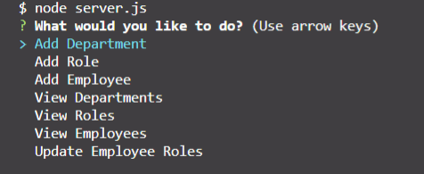
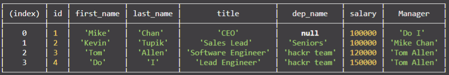
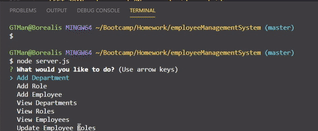

# employeeManagementSystem

The purpose of this project was to stretch and practice my skills in node.js but creating a system that might be used by a corporation with many different employees, roles, and departments.  The user can create as many employees, roles, and departments as they wish and even view them in a table.  Feel free to play around with the code!

link to gitHub Repo:
<https://github.com/GabrielTMangum/employeeManagementSystem>

<h1>Gif of Working App:</h1>

